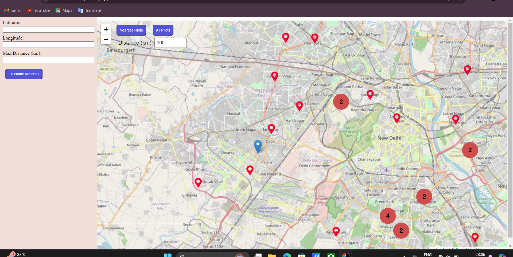
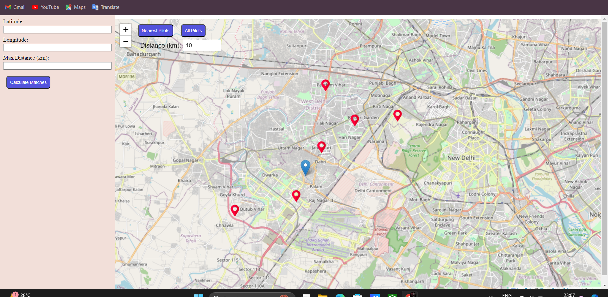
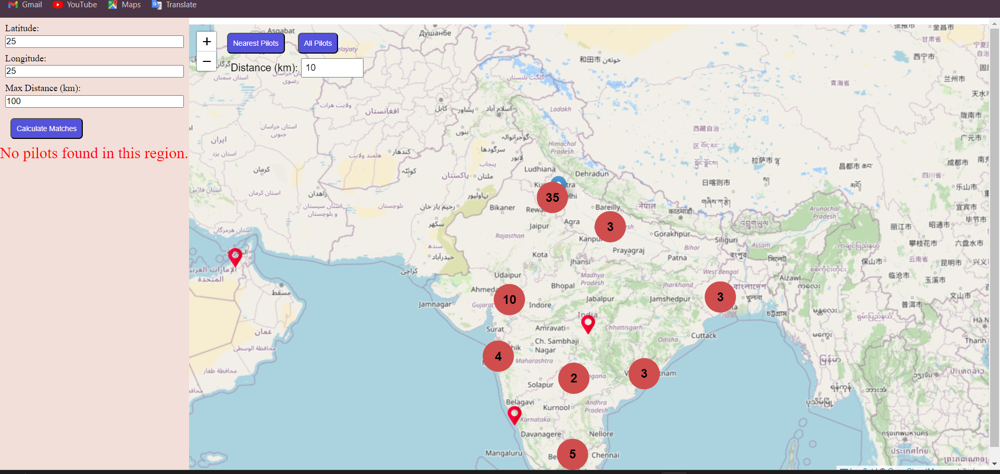
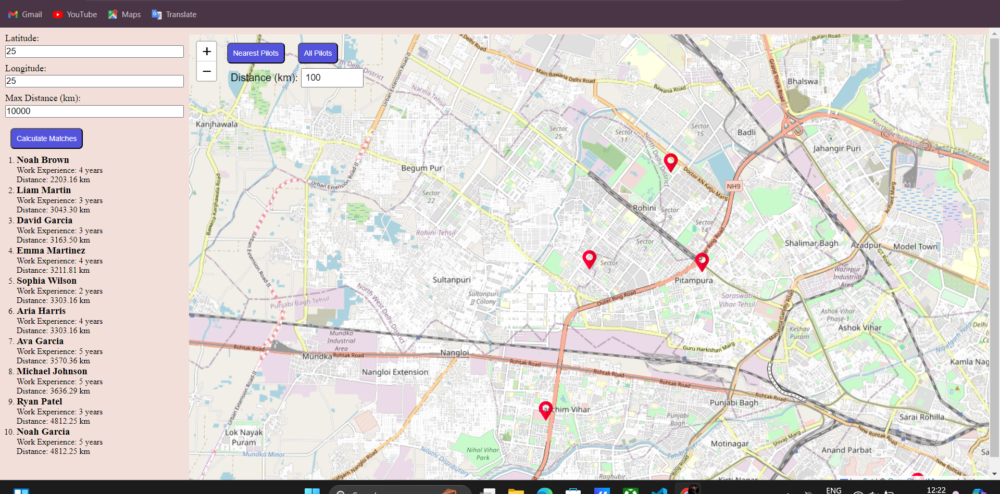
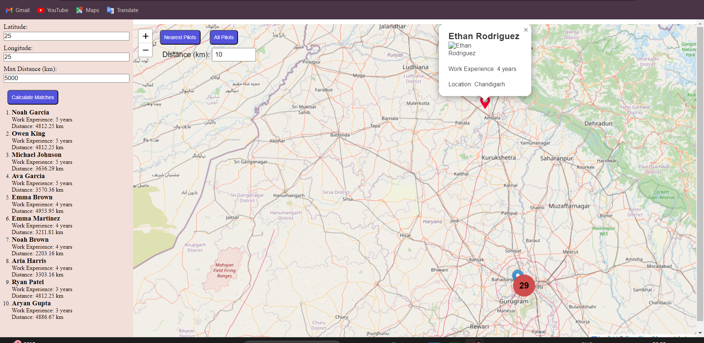

# Drone Pilot Locator

Drone Pilot Locator is a web application that helps you find the nearest drone pilots from a specified location. This project uses React, Leaflet for maps, and a clustering feature for efficient marker management.

## Live Demo

[Check out the live demo here](https://drone-pilot-map.netlify.app/)

## Features

- Display all drone pilots on the map.
- Filter drone pilots within a specified distance range.
- View details of each drone pilot including name, profile image, work experience, and location.
- Admin's current location displayed on the map.
- View drone pilots within a specified distance range from Admin.
- Clustured when lot of Tooltip together.

## Screenshots

### 1. All Pilots Displayed(Red Marker) & User Also(Blue Marker)


### 2. Nearest Pilots From User(10 Km range)


### 3.If No Pilots Is In The Range User Give(cordinates[25, 25] and distance 10Km)


### 4. Pilots Location with Filter Controls(cordinates[25, 25] and distance 5000Km)


### 5. Pilots Details When Clicking The Tooltip


## Video Demo

### Screen Recording of Drone-Pilots-Locator website.
[](https://www.youtube.com/watch?v=5bmOmVaYuwI)


## Installation

1. Clone the repository
   ```sh
   git clone https://github.com/tusharawat01/drone-piolet-map.git

